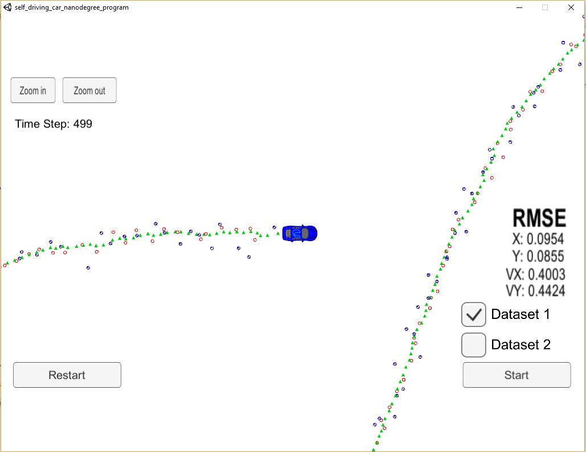

# Extended Kalman Filter Project Starter Code
Self-Driving Car Engineer Nanodegree Program

In this project you will utilize a kalman filter to estimate the state of a moving object of interest with noisy lidar and radar measurements. Passing the project requires obtaining RMSE values that are lower than the tolerance outlined in the project rubric. 

This project involves the Term 2 Simulator which can be downloaded [here](https://github.com/udacity/self-driving-car-sim/releases)

This repository includes two files that can be used to set up and install [uWebSocketIO](https://github.com/uWebSockets/uWebSockets) for either Linux or Mac systems. For windows you can use either Docker, VMware, or even [Windows 10 Bash on Ubuntu](https://www.howtogeek.com/249966/how-to-install-and-use-the-linux-bash-shell-on-windows-10/) to install uWebSocketIO. Please see [this concept in the classroom](https://classroom.udacity.com/nanodegrees/nd013/parts/40f38239-66b6-46ec-ae68-03afd8a601c8/modules/0949fca6-b379-42af-a919-ee50aa304e6a/lessons/f758c44c-5e40-4e01-93b5-1a82aa4e044f/concepts/16cf4a78-4fc7-49e1-8621-3450ca938b77) for the required version and installation scripts.

Once the install for uWebSocketIO is complete, the main program can be built and run by doing the following from the project top directory.

1. mkdir build
2. cd build
3. cmake ..
4. make
5. ./ExtendedKF

-----
## Writeup

## Compiling

### Your code should compile

Buildtoolchain setup works and code compiles according to the description above.

## Accuracy

### px, py, vx, vy output coordinates must have an RMSE <= [.11, .11, 0.52, 0.52] when using the file: "obj_pose-laser-radar-synthetic-input.txt which is the same data file the simulator uses for Dataset 1"

Measured RMSE values are: [0.0954, 0.0855, 0.4003, 0.4424]
-> in range.

## Following the Correct Algorithm

### Your Sensor Fusion algorithm follows the general processing flow as taught in the preceding lessons.

The basic implementation is realized as taught in class:

The different implementation parts can be found under src.

### Your Kalman Filter algorithm handles the first measurements appropriately.

The initialization and first measurements are handled in the files ./src/FusionEKF.cpp and ./src/kalman_filter.cpp.

### Your Kalman Filter algorithm first predicts then updates.

In the function FusionEKF::ProcessMeasurement (file src/FusionEKF.cpp), the structure is clear:
* initialization
* prediction
* update 

### Your Kalman Filter can handle radar and lidar measurements.

In the function FusionEKF::ProcessMeasurement (file src/FusionEKF.cpp), most parts are split into a laser and a radar part.

## Code Efficiency

### Your algorithm should avoid unnecessary calculations.

Throughout the code, nothing should be compiled several times when it isn't necessary.
Private member are used to store the variables/parameters instead of calculating the same algorithm over and over again.
